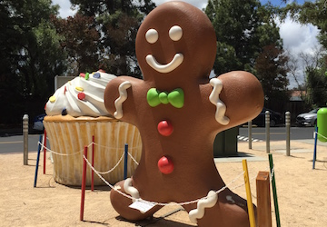

Android Cupcake App
=====================================
**Inspired from [Cupcake](https://developer.android.com/about/versions/android-1.5.html) version 1.5**

This sample demonstrates usage of Django Rest Api for [Django Cupcakeshop tutorial](https://github.com/DjangoGirlsSeoul/djangocupcakeshop)

Pre-requisites & Libraries
--------------

- Android SDK v19
- Realm
- Retrofit
- Data Binding

Getting Started
---------------

This app uses the Gradle build system. To build this project, use the
"gradlew build" command or use "Import Project" in Android Studio.

Screenshots
-----------

TO-DO
---------------

1. POST request

License
-------

#### The MIT License (MIT)

Copyright (c) Hassan Abid

Permission is hereby granted, free of charge, to any person obtaining a copy of
this software and associated documentation files (the "Software"), to deal in
the Software without restriction, including without limitation the rights to
use, copy, modify, merge, publish, distribute, sublicense, and/or sell copies
of the Software, and to permit persons to whom the Software is furnished to do
so, subject to the following conditions:

The above copyright notice and this permission notice shall be included in all
copies or substantial portions of the Software.

THE SOFTWARE IS PROVIDED "AS IS", WITHOUT WARRANTY OF ANY KIND, EXPRESS OR
IMPLIED, INCLUDING BUT NOT LIMITED TO THE WARRANTIES OF MERCHANTABILITY,
FITNESS FOR A PARTICULAR PURPOSE AND NONINFRINGEMENT. IN NO EVENT SHALL THE
AUTHORS OR COPYRIGHT HOLDERS BE LIABLE FOR ANY CLAIM, DAMAGES OR OTHER
LIABILITY, WHETHER IN AN ACTION OF CONTRACT, TORT OR OTHERWISE, ARISING FROM,
OUT OF OR IN CONNECTION WITH THE SOFTWARE OR THE USE OR OTHER DEALINGS IN THE
SOFTWARE.
